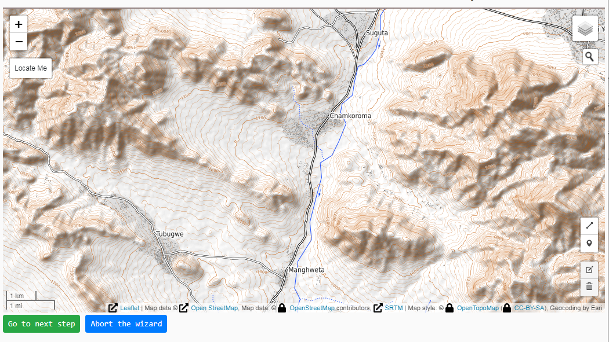

# Design a new rural water supply

We illustrate how to use this software in order to design a gravity-fed rural water supply. We have a water spring and one or more water tanks at a lower elevation than the spring, where water will flow by gravity.

We assume that we know how much water is required at each of the water tanks every day.

We want to find the commercial water pipes which will bring the water at the lowest economic cost.

## First step

First, navigate to the [demo](http://ruralwater.pythonanywhere.com/gravity/design/step/0/) You will be prompted with a map.

### What’s happening here

Use the mouse to pan and zoom the map in the area of your interest. Here, for illustration purposes, we show the area of ‘Chamkoroma’ in central Tanzania.

Click on the marker icon in the toolbar.

|[Ooops...! The map is not showing correctly :-(](_images_new/2_tools-select-marker-with-red.png)

Place a marker on the position of the spring intake, by clicking on the map.

==demo list==

1. alfa
2. beta
3. gamma

## subheading

a link to [ruralwater](http://ruralwater.pythonanywhere.com/design/wizard/0/)

### smaller

lorem

