# Design a new rural water supply

We illustrate how to use this software in order to design a gravity-fed rural water supply. We have a water spring and one or more water tanks at a lower elevation than the spring, where water will flow by gravity.

We assume that we know how much water is required at each of the water tanks every day.

We want to find the commercial water pipes which will bring the water at the lowest economic cost.

## First step

First, navigate to the [demo](http://ruralwater.pythonanywhere.com/gravity/design/step/0/) You will be prompted with a map.

### What’s happening here

Use the mouse to pan and zoom the map in the area of your interest. Here, for illustration purposes, we show the area of ‘Chamkoroma’ in central Tanzania.

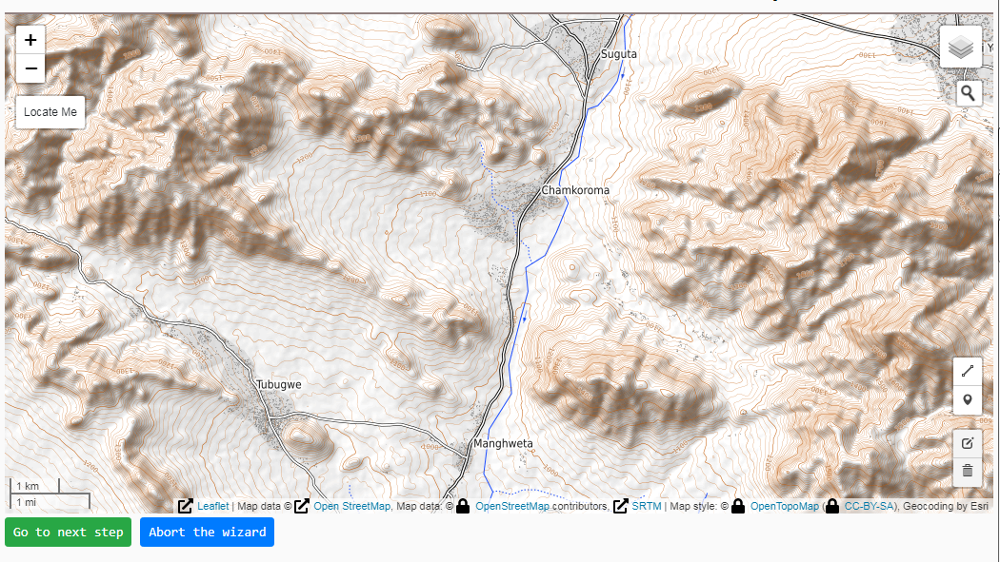

Click on the marker icon in the toolbar.

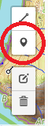

Place a marker on the position of the spring intake, by clicking on the map.

### What’s happening here

Your first click defines the position of the **source** of water.

Proceeed to draw your ‘tree’ of pipe trenches from the spring until the water reservoirs in the ‘villages’ (or near where the benefciries live).

To this end, click in all points of the map, which correpond either to a reservoir or to a junction. You will end up with a number of markers shown on the map. 

*Remark*: every time you click the marker icon in the toolbar you can place one marker on the map. Then you need to click **again** on the toolbar marker icon to place the following marker on the map.

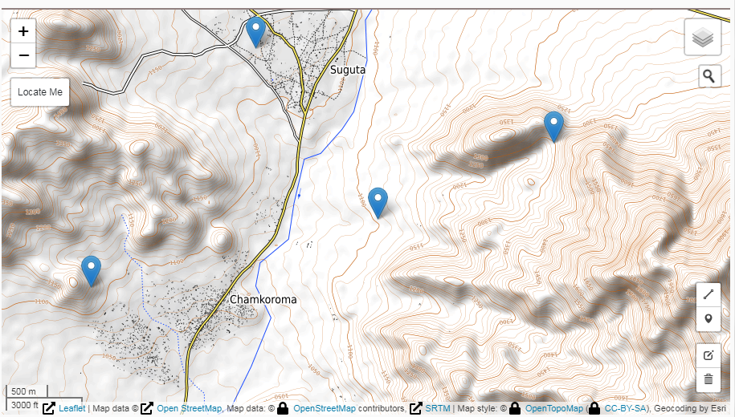

## Second step

Click on the ‘line’ marker in the toolbar.

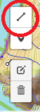

### What’s happening here

Starting from the water source, connect the various markers with a line that represents the trench where you want to lie down the water pipes.

If needed, you can click along the way, while you draw the line, in order to make your water pipe trench bend.

Notice that the line ‘sticks’ to the markers when you move the mouse near a marker. When the line ‘sticks’ to a marker, then you complete drawing the line by double clicking.

Notice that, once you have selected the line icon on the toolbar, then as you move the mouse a red circle appears to the nearest marker to your mouse position. When the red circle appears around the spring, then you click and move the mouse towards another marker to complete the line.
At any time, the red circle appears to the closest marker to the mouse and you complete the drawing by **double clicking**.

Remark: this red circle is a substitute for makin the mouse pointer 'stick' to the markers; this will be implemente in a future version.

Next, you need to select again the ‘line’ marker in the toolbar, and draw another trench. And so on, until you drew all the trenches.

If needed, you can click along the way, while you draw the line, in order to make your water pipe trench bend.

The beginning of the line: 
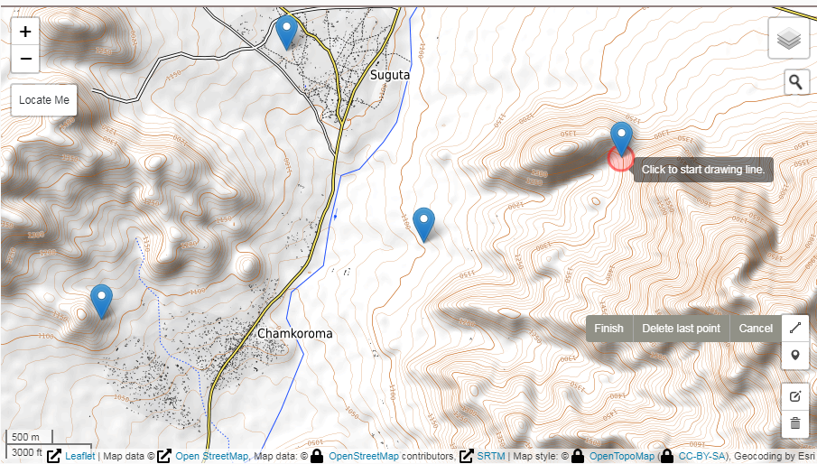

The ending of the line: 
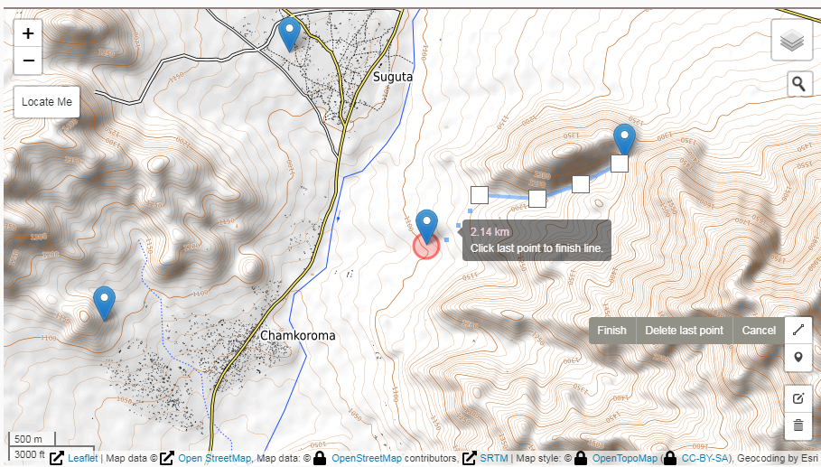

The line was drawn:
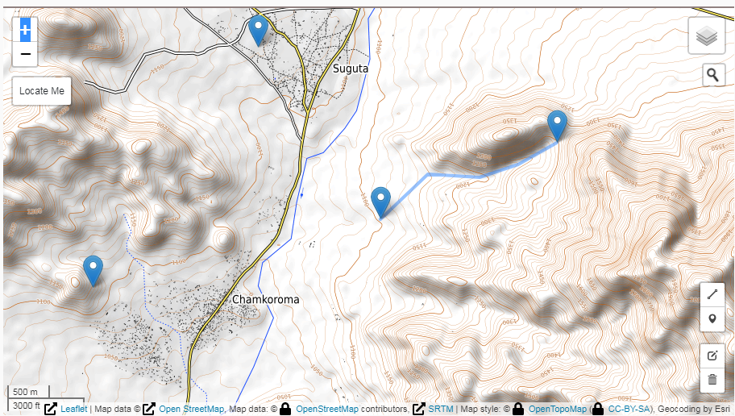

### What’s happening here

You draw all the water pipes, one after the other.

For example, from the spring source to the first junction or reservoir, as shown in the above image. Then, from the junction to one of the villages reservoir.

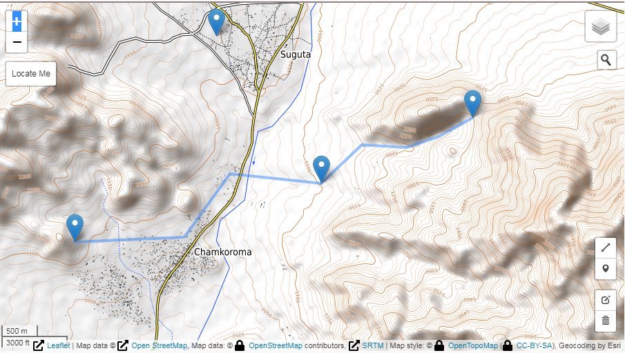

Finally, from the junction to the reservoir of the other village reservoir.

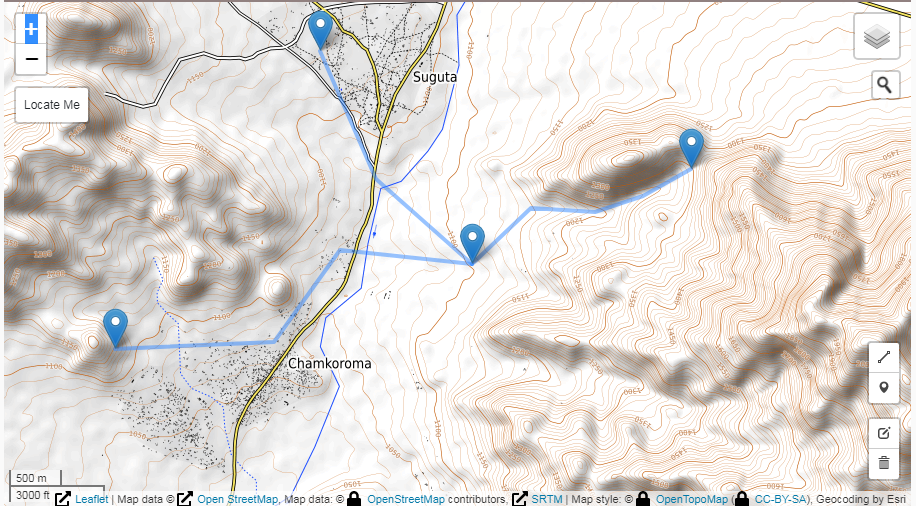

**Once you have completed drawing of the tree of pathways** it is now time to define the amount of water required to be transported by the pipes you just drew.

## Third step

You may now define how much water is required at each of the reservoirs.

### What’s happening here

You can now click the markers to define the amount of water required, but for the first marker (the one of the spring).

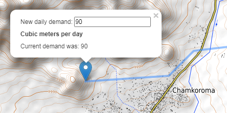

Enter how many cubic meters are needed at each reservoir. To ease data input, remember that the value of 86, represents one liter per second flowing along the 24 hours.

If you leave one of the demands **empty** that will mean that you do not need water at that point, and the software will consider the point as a junction (under pressure) and not as a reservoir.

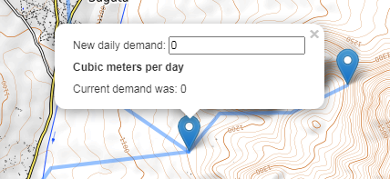

Important!

You must define a demand for the leaves of your water supply, i.e.: for the “leaves” of your tree of trenches. Otherwise, when you will click the "Go to next step" button, you will be prompted a pop-up by those reservoirs left without demand.

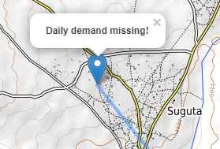

**Once you have defined the demands** click on the "Forward" button to move to the next step of the wizard.

# Fourth step

ruralwater will now carry out its calculations trying to find the best economic pipes to supply by gravity the amount of water you specified.

The unit cost of pipes at present cannot be edited by the user and is inferred from some data from the field.

You will be shown a page with the proposed polyethylene pipes along with the altimetric and hydraulic pressure profiles for each of the branches of your water supply.

If there is no way to carry the water (for example, either the terrain is too flat to carry that amount of water by gravity) then the webapp will inform you that the design failed.

| First pathway  | Second pathway | Third pathway |
| ------------- | ------------- |------------- |
| 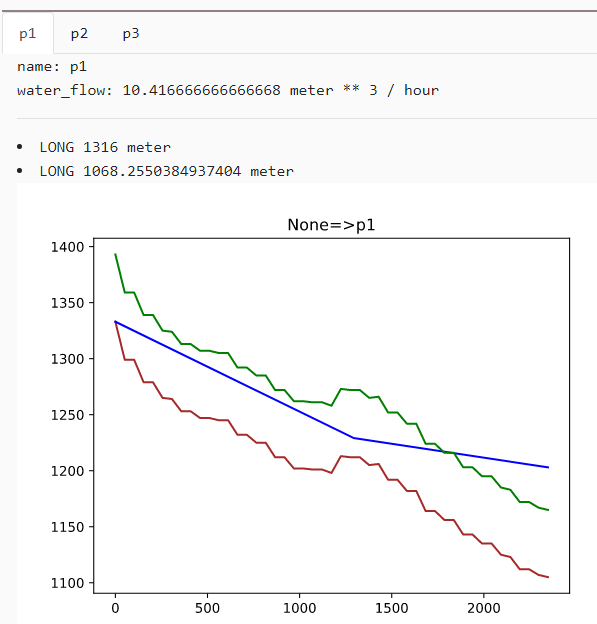  | 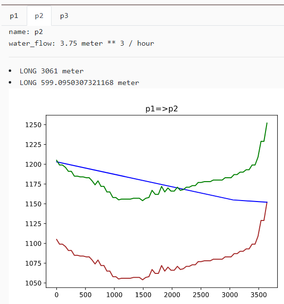  | 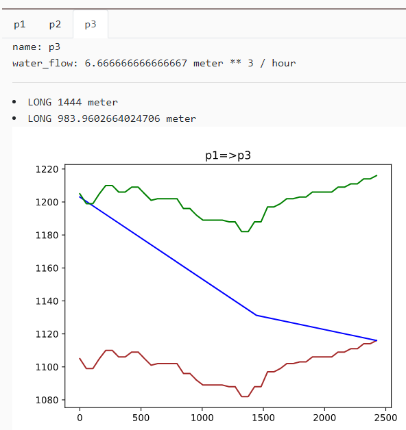 |

Click on the images to see them enlarged.

Important

The drawings will also show (in green color) the profile at 60 meters above the ground level. If the pressure profile intersects this line, care must be taken to use higher pressure polyethylene pipes. For deeper valleys also the profile at 100 meters above the ground surface will be shown, hinting that even hgher pressure pipes must be used. The improved calculations, which optimize taking in account these higher pressure will be released soon. 

Remark: the unit costs of polyethylene pipes is inferred from economies of scale. In a future verion it will be possible to enter the unit cost of the pipes.

This completes the use of the webapp in this 2020 version.
