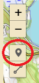

<h1>Design a new rural water supply<a class="headerlink" href="#design-a-new-rural-water-supply" title="Permalink to this headline">¶</a></h1>

<h2>First step<a class="headerlink" href="#first-step" title="Permalink to this headline">¶</a></h2>

First, navigate to <a class="reference external" href="http://ruralwater.pythonanywhere.com/">the demo</a>
You will be prompted with a map.

<h3>What’s happening here<a class="headerlink" href="#what-s-happening-here" title="Permalink to this headline">¶</a></h3>

Use the mouse to pan and zoom the map in the area of your interest. Here, for illustration purposes, we show the area of ‘Chamkoroma’ in central Tanzania.

Click on the marker icon in the toolbar

Place a marker on the position of the spring intake, by clicking on the map.

<h3>What’s happening here<a class="headerlink" href="#id1" title="Permalink to this headline">¶</a></h3>

Your first click defines the position of the <strong>source</strong> of water.

Proceeed to draw your ‘tree’ of pipe trenches from the spring until the water reservoirs in the ‘villages’ (or near where the benefciries live).

To this end, click in all points of the map, which correpond either to a reservoir or to a junction.
You will end up with a number of markers shown on the map.

<h2>Second step<a class="headerlink" href="#second-step" title="Permalink to this headline">¶</a></h2>

Click on the ‘line’ marker in the toolbar.

<h3>What’s happening here<a class="headerlink" href="#id2" title="Permalink to this headline">¶</a></h3>

Starting from the water source, connect the various markers with a line that represents the trench where you want to lie down the water pipes.
Notice that the line ‘sticks’ to the markers when you move the mouse near a marker.
When the line ‘sticks’ to a marker, then you complete drawing the line by <strong>double clicking</strong>.

If needed, you can click along the way, while you draw the line, in order to make your water pipe trench bend.

<h3>What’s happening here<a class="headerlink" href="#id3" title="Permalink to this headline">¶</a></h3>

You draw all the water pipes, one after the other.

For example, from the spring source to the first junction or reservoir.

Then, from the junction to one of the villages reservoir.

Finally, from the junction to the reservoir of the other village reservoir.

Important

This is an initial version of the webapp so the user interface
is basic and assumes that the user completes all operations correctly.

<blockquote>

In particular, you must connect all the markers using the ‘sticking’ effect.
If you fail to do so, or if you draw lines which do not end onto markers, the results
will be an error (shown when you click the ‘Forward’ button below the map) and you will be requested to restart from scratch your drawing.

</blockquote>

Improvements are under way in a future version.

<strong>Once you have completed drawing</strong> click on the <code class="docutils literal notranslate">Forward</code> button to move to the next step of the wizard.

<h2>Third step<a class="headerlink" href="#third-step" title="Permalink to this headline">¶</a></h2>

You may now define how much water is required at each of the reservoirs.

<h3>What’s happening here<a class="headerlink" href="#id4" title="Permalink to this headline">¶</a></h3>

You are presented a form, with one row for each of the markers you defined in the map, but for the first marker (the one of the spring).

Enter how many cubic meters are needed at each reservoir. The default value of 86, represents one liter per second flowing along the 24 hours.

If you leave one of the demands <strong>empty</strong> that will mean that you do not need water at that point, and the software will consider the point as a junction (under pressure) and not as a reservoir.

Important

Again, this is an initial version of the webapp and the user interface is basic and assumes the user performs all operations correctly.
In particular, here, you must define a demand for the <em>leaves</em> of your water supply, i.e.: for the “leaves” of your tree of trenches. Otherwise and error will occour and you will have to restart the drawing process from scratch.

<strong>Once you have defined the demands</strong> click on the <code class="docutils literal notranslate">Forward</code> button to move to the next step of the wizard.

<h2>Fourth step<a class="headerlink" href="#fourth-step" title="Permalink to this headline">¶</a></h2>

ruralwater will now carry out its calculations trying to find the best economic pipes to supply by gravity the amount of water you specified.

The unit cost of pipes at present cannot be edited by the user and is inferred from some data from the field.

You will be shown a page with the proposed polyethylene pipes along with the altimetric and hydraulic pressure profiles for each of the branches of your water supply.

If there is no way to carry the water (for example, either the terrain is too flat to carry that amount of water by gravity) then the webapp will inform you that the design failed.

Important

The drawings will also show (in green color) the profile at 60 meters above the ground level. If the pressure profile intersects this line, care must be taken to use higher pressure polyethylene pipes. The improved calculations, which optimize taking in account these higher pressure will be released soon. Further, it will be possible to edit the unit costs of polyethylene pipes.

This completes the use of the webapp in this initial version.

